# chli3234-tracker

1. 对开发过程、迭代和改进的深入
2. 特别强调经验教训和最佳实践
3. 细致且易于遵循的应用程序配置
4. 部署程序大纲
5. 并附有对进一步改进或扩展的深思熟虑的建议。

# Iteration and improvement part

* __feedback from tutor and Assessment 3__ For this Final Assessment, I almost refresh and iterate all the context and data model related to my assessment 3. 

* __1.The first one is data model question__ This images is my previous data model, but it's too board. Therefore tutor suggest me to narrow down the target audience futher to help justify further design choices. And also An online community and recommendations is beyond the scope of this task, so it's not necessary to include these goals. the data model should cover each data point for each item that the user inputs, it should not include the users personal details for something such as a profile as this information would only need to put in once.

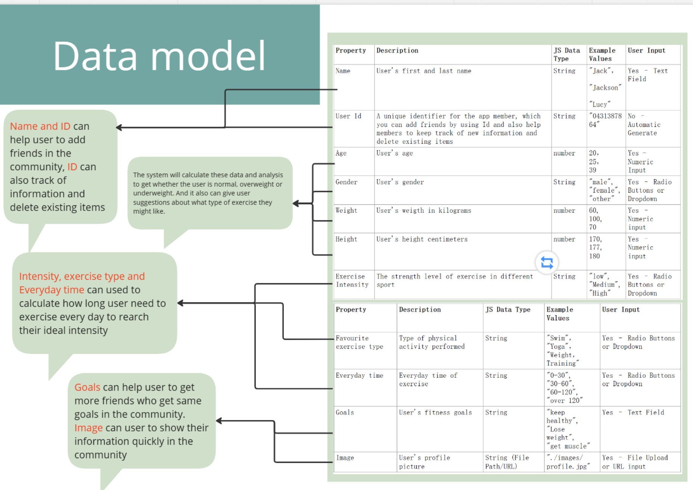

* __1.data model question iteration and improvements__ Therefore, I Finish my new data model, which contains "Name", "Weight", "Duration”，"Exercise Type", "Strength" And also auto caluclute data "time", "id" and "Calories Burned". I narrow my target user scope from whole sport group to swimming group. 
**.**
1. Calories Burned : are caluculate from "weight,duration,strength" . It can tell user how much calories burned during different swimming exercise. 
**.**
2. Exercise type: "warm-up", "swimming" and "others" These can be get correspond images 
**.**
3. Strenght type: "light", "moderate" and "heavy" These can be get correspont images and show it in website.

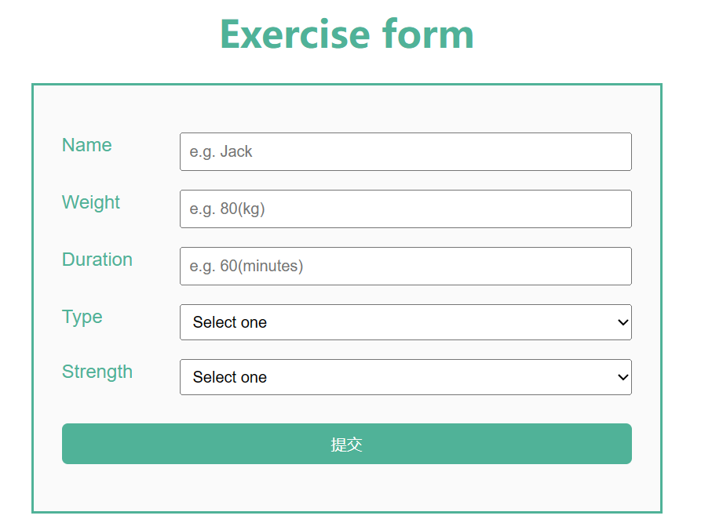

This is How I use these datas from user and auto calculate. These will be  suggest plan help user to get their own today plan and record their exercise in the local storage. And also give the some feedback about "This is how many Claories I burned during exercise and also give me clear visual plan"

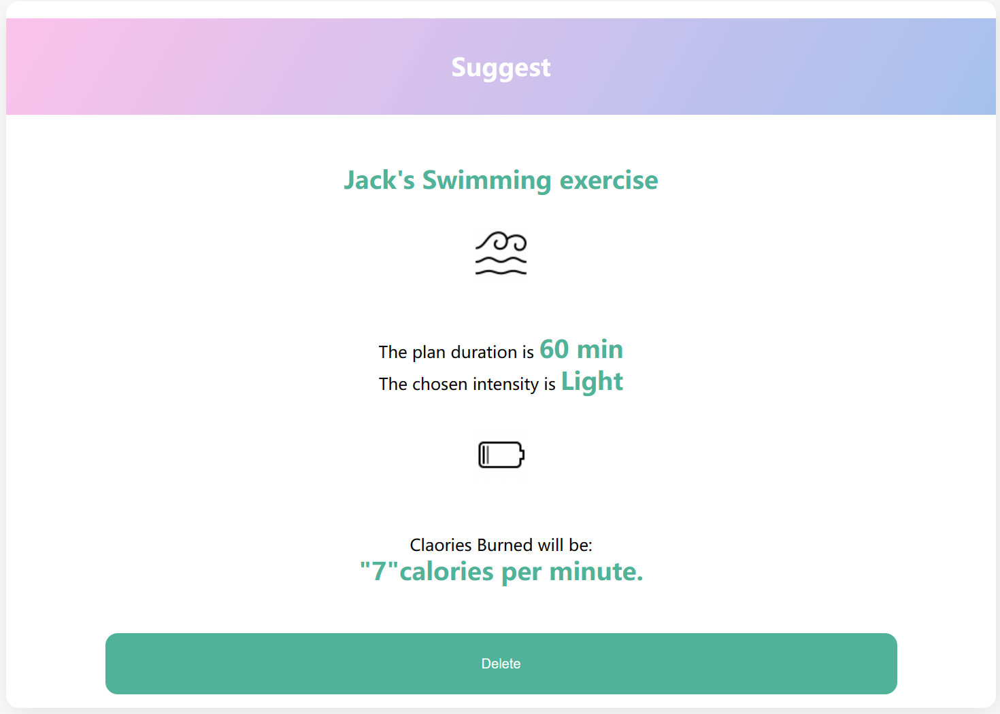

* __2.wireframe, mockup question iteration and improvements__  For this part, I also rebuild my website and try to make it better. Because the original one, I make too many pages but didn't use data model very well. Therefore, tutor told me that " It is unclear from the wireframes how a user would input their fitness activities. You have included different pages on the website, however in the design brief we have specified only one page." And also on the mockup part "The style choice and branding was a nice tough to the mockups. Your mockups were mostly well designed with a strong colour palette. Some of the alignment was off with words overlapping other elements. Once again, good justification of design and styling choices. Some of the images it is unclear if they are clickable or not, it may be good to include hover states to show this. The "my plan" page is the only page that refers back to tracking, however you do not show how a user would track their exercises."

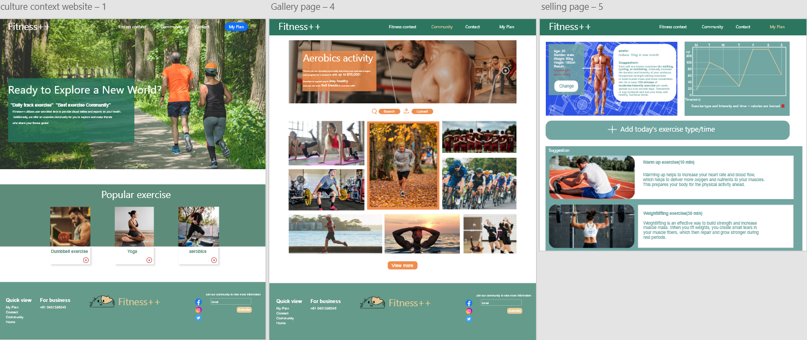

Therefore, I decided to improve my website. Firstly, I cancelled two other pages and rebuild my new pages, to make sure It can help user track their exercise clearly and use it without confused. my new website contains 5 part, and three part are used data model, one make responsive.

**1.HeroImages Part** this part I showed my brandElement "Fitness" and tell the user what our website can provide and how can we help them in our website.

**2.Everyday Tips Part**
this part, I used responsive design in it. When user want to know more information like "Why warm-up Important" they can click the button. I used addEventListener in the script.js which can catch user active and provide detail below.

 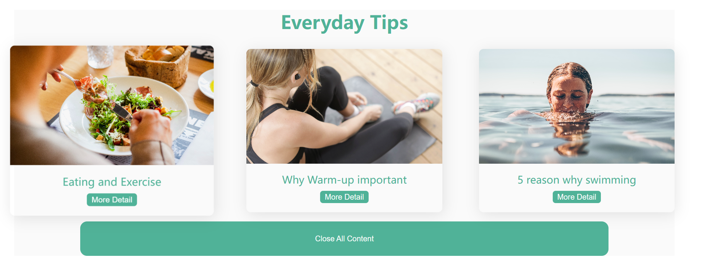

 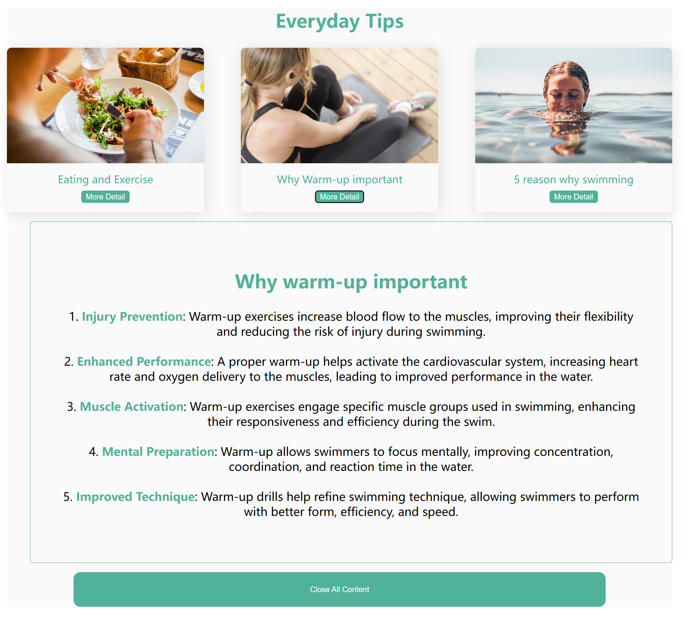

**3.Exercise form Part**
Now, we headed to the data model part, The user could write their data into the form and press the submit. All the data will occurs in the Today Plan Part. For Example I used the data "name: Jack, Weight : 80, Duration: 60, Type: Warm up, Strength: light." These Data will be remember in the local storage. Don't worry it will lose when fresh the page
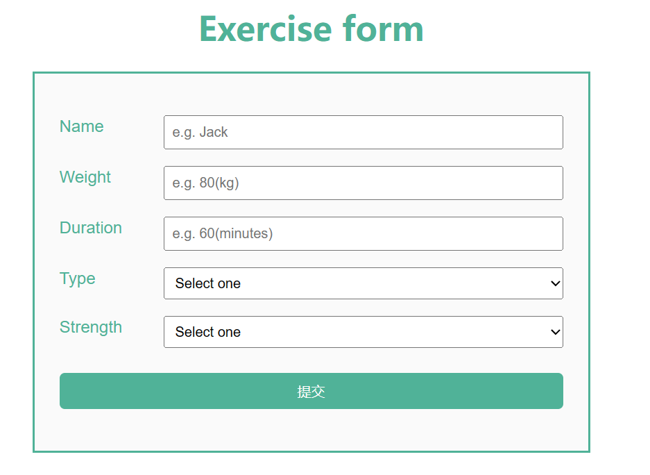

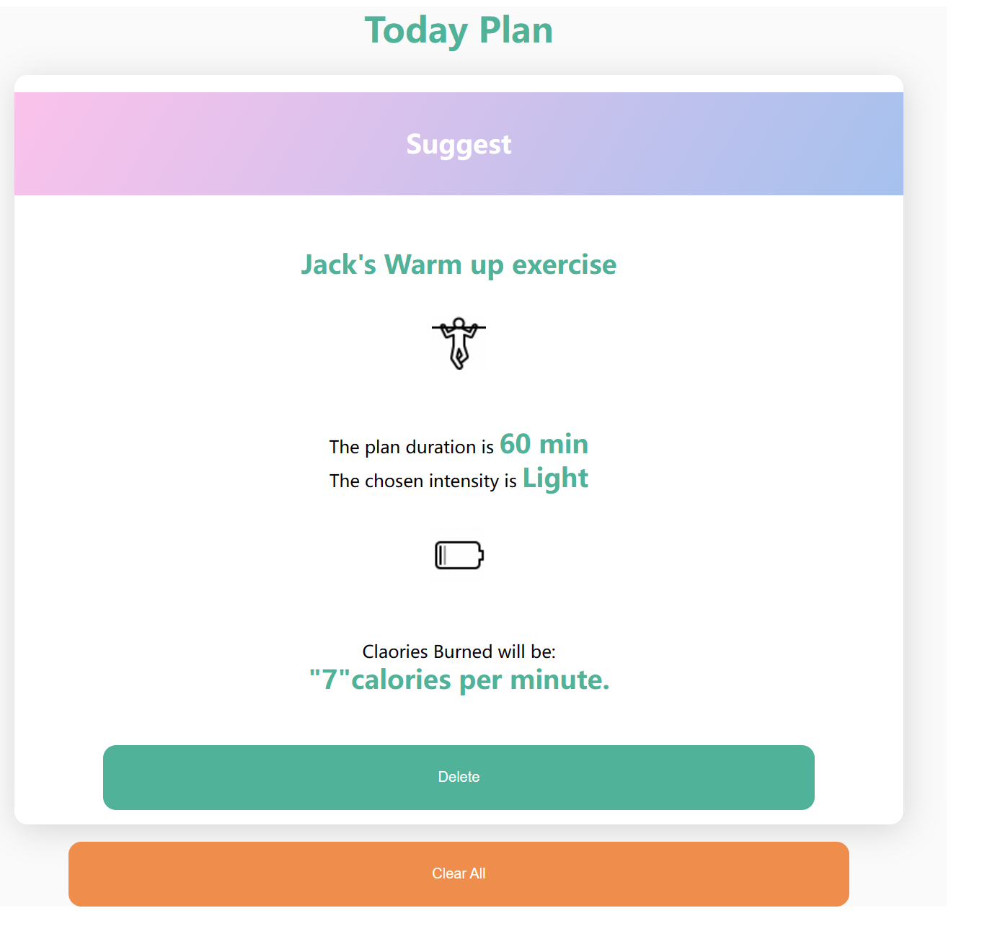

**4.Today Plan Part**
As I mentioned before, As user input the value in the exercise form and submit it. The today plan will generate one corrospond plan for user. It will give text and visual element and also tell user how many Claories they burned during exercise. User could delet it or add more from the Exercise Form or Exercise Suggest.

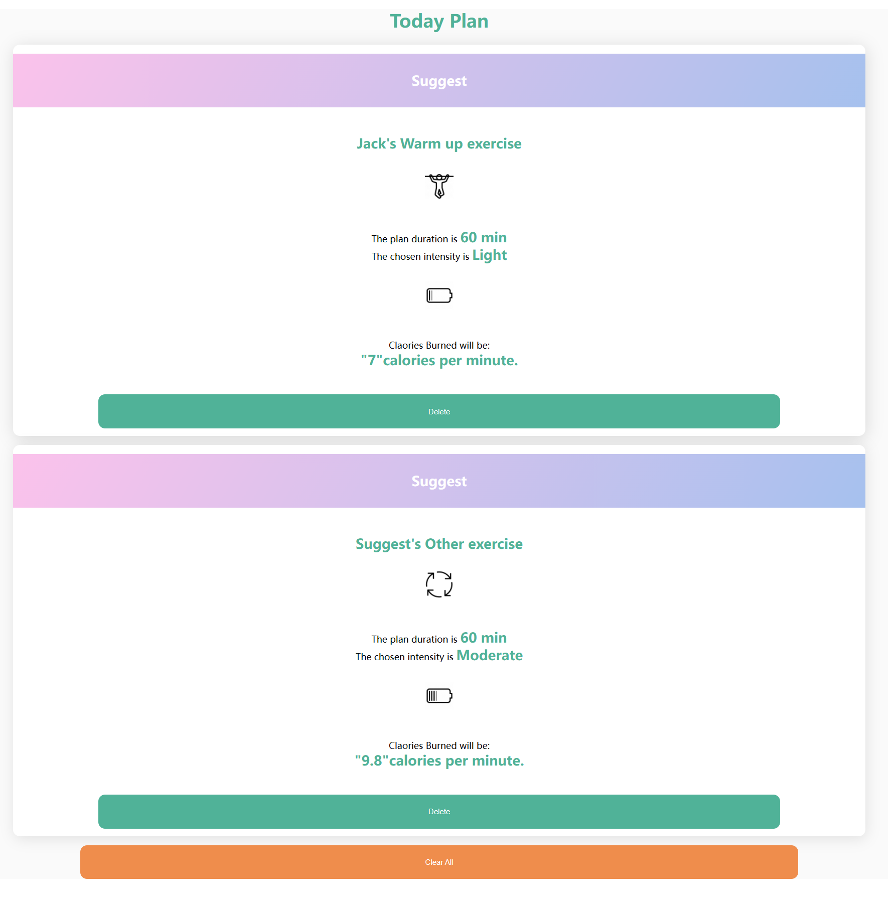

**5.Exercise Suggest**
The last part is exercise suggest, which contains 4 suggest card, if user like one of them, they can just clicked the "ADD" button, which will add this form into the Today Plan Part. They can use these Suggest Plan as their own plan.

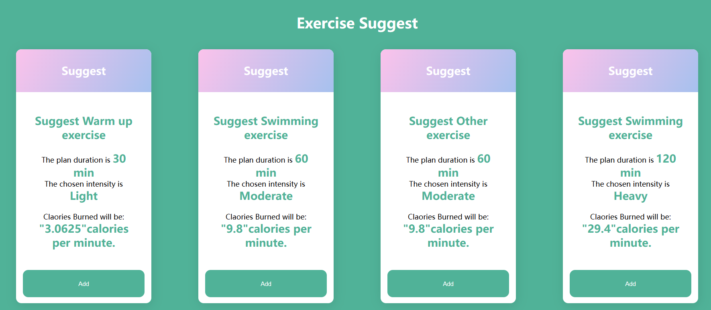

**This is 3rd Suggest Plan in Today Plan Part**

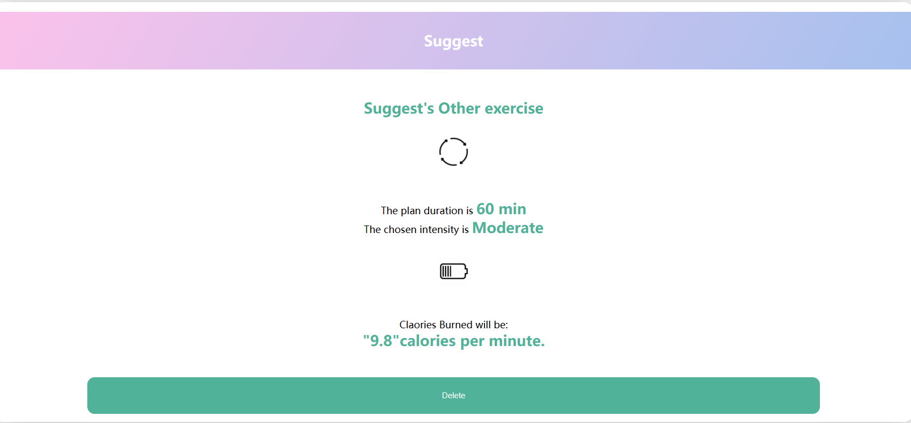
